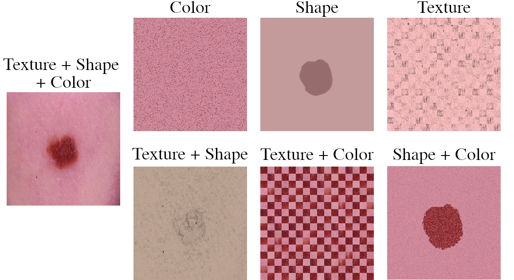

# Revisiting the Shape-Bias of Deep Learning for Dermoscopic Skin Lesion Classification

Official research code repository of our research paper `Revisiting the Shape-Bias of Deep Learning for Dermoscopic Skin Lesion Classification` accepted at MIUA 2022.


***Figure 1.** Overview of feature ablations used to investigate the influence of Texture, Shape, and Color in Dermoscopic Skin Lesion Classification.*

## Abstract
It is generally believed that the human visual system is biased towards the recognition of shapes rather than textures. This assumption has led to a growing body of work aiming to align deep models' decision-making processes with the fundamental properties of human vision. ThPe reliance on shape features is primarily expected to improve the robustness of these models under covariate shift. In this paper, we revisit the significance of shape-biases for the classification of skin lesion images. Our analysis shows that different skin lesion datasets exhibit varying biases towards individual image features. Interestingly, despite deep feature extractors being inclined towards learning entangled features for skin lesion classification, individual features can still be decoded from this entangled representation. This indicates that these features are still represented in the learnt embedding spaces of the models, but not used for classification. In addition, the spectral analysis of different datasets shows that in contrast to common visual recognition, dermoscopic skin lesion classification, by nature, is reliant on complex feature combinations beyond shape-bias. As a natural consequence, shifting away from the prevalent desire of shape-biasing models can even improve skin lesion classifiers in some cases.

---

## How To Reproduce Results

### Prepare Datasets
To reproduce our work, please download the following datasets from the respective URLs.

| Name | URL |
| --- | --- |
| Derm7pt | [Link](https://derm.cs.sfu.ca/Welcome.html) |
| ISIC | [Link](https://challenge.isic-archive.com/data/) | 
| Imagenette | [Link](https://github.com/fastai/imagenette) |
| Imagewoof | [Link](https://github.com/fastai/imagenette) |

Place the datasets in the `data` folder as described below:

```
    .
    ├── data                   
    │   ├── Derm7pt                    
    │   │   ├── original         
    │   │   │   ├── images    
    │   │   │   ├── meta 
    │   │   │   ├── clinic.html 
    │   │   │   ├── derm.html 
    │   │   │   └── README.txt     
    │   │   :        
    │   │   └── segmentations
    │   │         
    │   ├── Imagenette
    │   │   ├── original 
    │   │   │   └── imagenette2-320
    │   │   : 
    │   │       
    │   ├── Imagewoof
    │   │   ├── original   
    │   │   │   └── imagewoof2-320    
    │   │   : 
    │   │       
    │   ├── ISIC 
    │   │   ├── original
    │   │   │   ├── 2016    
    │   │   │   ├── 2017 
    │   │   │   ├── 2018
    │   │   │   ├── 2019
    │   │   │   └── 2020
    │   │   : 
    │   │   └── segmentations
    │   │       
    │   :       
    :
```

To generate all ablations and datadings files please first run the notebooks located in `./data/`, and then all the notebooks in the respective dataset folders under `./data/*/scripts/`.

### Generating Experiment Results

Please first setup a python environment as specified in the requirements file (`./src/requirements.txt`). Then run all experiments by running following bash scripts in this order:

| Script | Description |
| --- | --- |
| `./src/bash_scripts/Exp01.sh` | Runs all baseline trainings as well as ablations for skin lesion datasets. |
| `./src/bash_scripts/Exp02.sh` | Runs cross-testing of all previously computed models. |
| `./src/bash_scripts/Exp03.sh` | Runs Deep Feature Reweighting on skin lesion datasets. |
| `./src/bash_scripts/Exp04.sh` | Runs baseline trainings for Imagenette and Imagewoof as well as phase-, and amplitude-removal for all datasets. |
| `./src/bash_scripts/Exp05.sh` | Runs APR benchmark (APR-P vs. AF-APR-P vs. MIX-APR-P). |

---

Please consider citing our associated [paper](https://arxiv.org/abs/2206.06466):
```
  @article{lucieri2022revisiting,
  title={Revisiting the Shape-Bias of Deep Learning for Dermoscopic Skin Lesion Classification},
  author={Lucieri, Adriano and Schmeisser, Fabian and Balada, Christoph Peter and Siddiqui, Shoaib Ahmed and Dengel, Andreas and Ahmed, Sheraz},
  journal={arXiv preprint arXiv:2206.06466},
  year={2022}
}

```